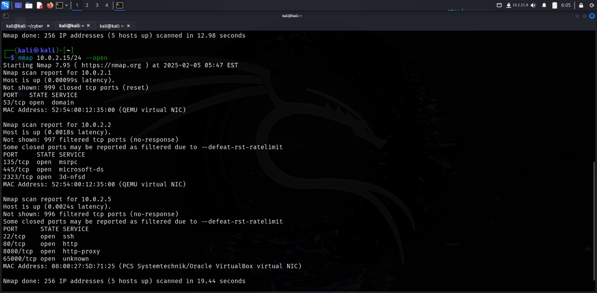
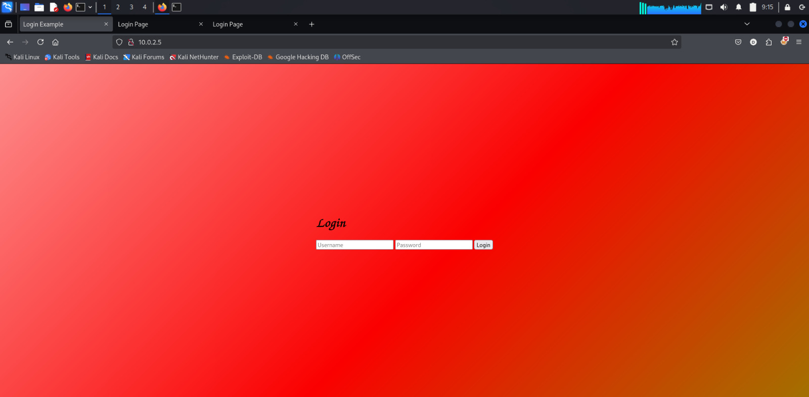
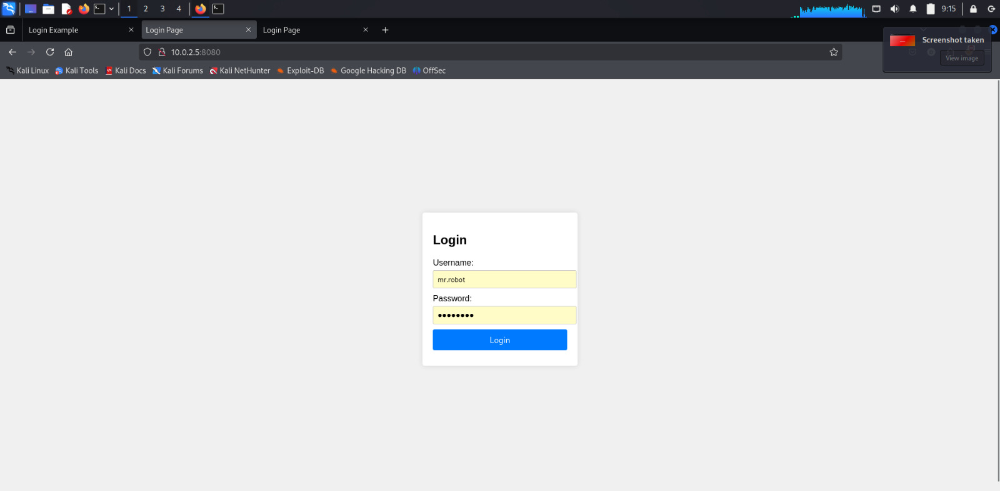
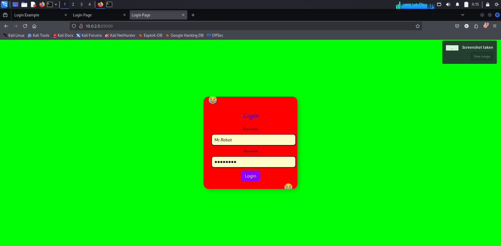
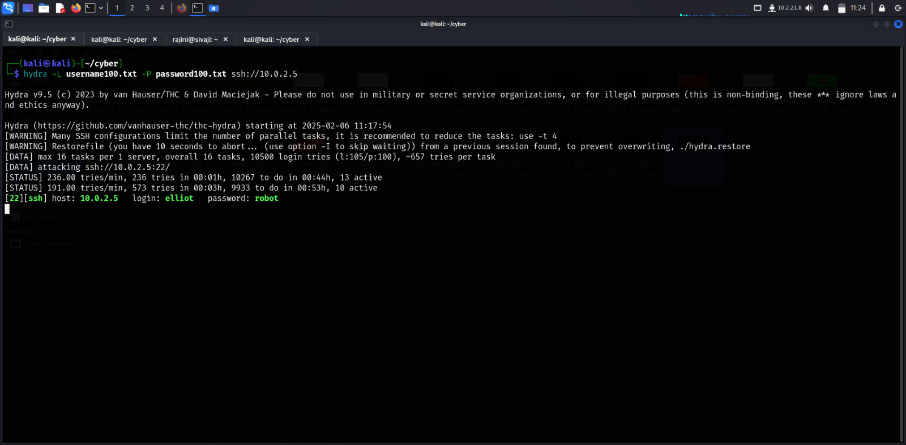
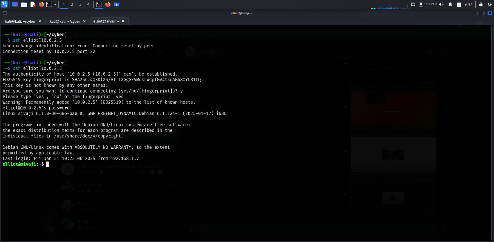
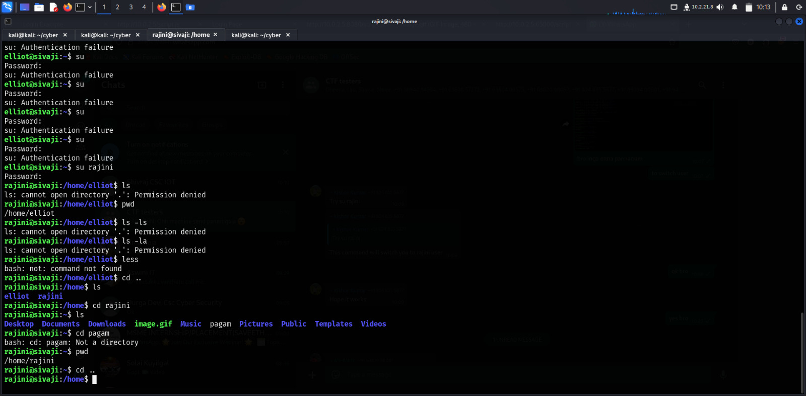

# Unknown Machine Cracking
my internship outcome of cracking a room made by people of Zybeak Technologies

# SOLVING OF CTF CHALLENGE


### To find IP address of unknown machine:

```nmap 10.0.2.15/24 –open```

 

### Run nmap scan for identified IP after neglecting unwanted options:

```nmap -sV -p- -T4 -A 10.0.2.5/24 –open```
 
 

 

### From the above scan, we can find 3 ports are available open to crack the machine i.e, port 80,8080,65000 are open
#### Port 80:


 
### Analysing the page source, we got login credentials
 


### Login the page
 


### Audio plays for successful login

#### Port 8080:
 


### Analysing the page source, we got login credentials
 


### Login the page


 
### Redirection is set to login page with timer of 15 seconds

#### Port 65000:
 


### Analysing the page source, we got login credentials

 

### Login the page


 
### Image gif appears 

#### When we analyse both the gif’s source, we come to know about login credentials of the machine
#### This is done using ‘ exiftool ‘ and encryption techniques like Atbash cipher and Caesar cipher

Or 

### Hydra tool can be performed to crack the user

```hydra -L username100.txt -P password100.txt ssh://10.0.2.5```
 
 

### After finding the login credentials of the unknown machine, login the server using ssh

```ssh elliot@10.0.2.5```


 
### Find the flag from pagam3 file

### To switch user, first see hidden files

```ls -la```
 
 

### Find the login credentials from hidden files as rajini@dec12
### Switch the user

```su rajini```


 
### Find the flag in pagam file


## Conclusion :
In this CTF challenge, we identified the target machine's IP using Nmap and conducted a thorough service enumeration. The scan revealed ports 80, 8080, and 65000 open, each leading to crucial login credentials through page source analysis.
By logging into each discovered portal, we encountered audio feedback, timed redirections, and hidden image files. Using ExifTool and decryption methods like Atbash and Caesar ciphers, we extracted additional credentials. Alternatively, brute-forcing with Hydra was an option.
With valid SSH credentials, we accessed the machine and explored hidden files, discovering another set of login details. Switching users with su, we ultimately retrieved the flag from the hidden pagam file, successfully completing the challenge. 🚩🔥

